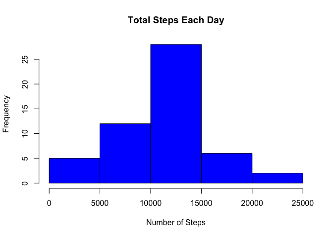
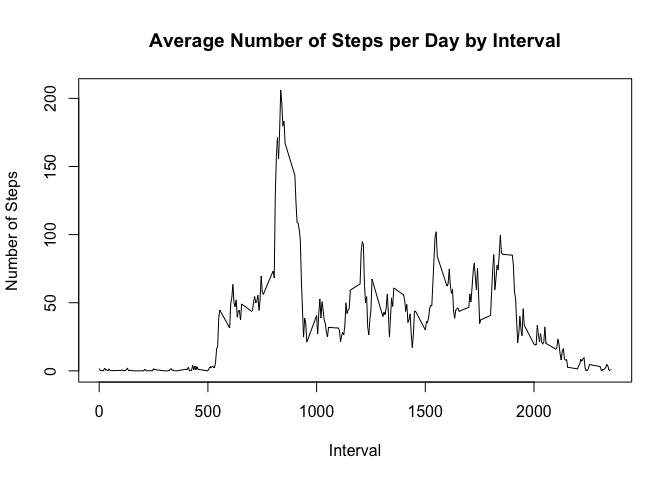
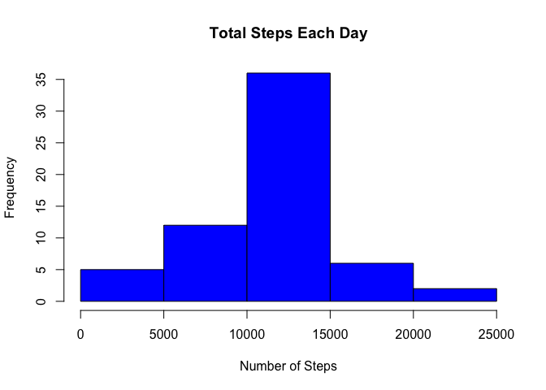
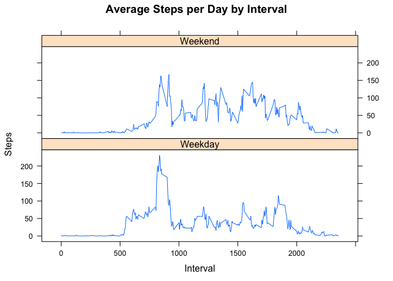

```r
echo = TRUE
```

## Loading and preprocessing the data


```r
unzip(zipfile = "activity.zip")
dt <- read.csv("activity.csv")
```

## What is mean total number of steps taken per day?

First, calc total steps per day and then make histogram of toal steps per day


```r
total_steps <-aggregate(steps ~ date, dt, sum)
hist(total_steps$steps, main = paste("Total Steps Each Day"), col="blue", xlab="Number of Steps")
```

\

Now calc mean and median of toal steps per day


```r
mean(total_steps$steps)
```

```
## [1] 10766.19
```

mean total steps = 10766.19


```r
median(total_steps$steps)
```

```
## [1] 10765
```

median total steps = 10765

## What is the average daily activity pattern?

Now, make time series plot of 5 minute interval (x) and ave number steps, averaged across all days (y)


```r
steps_5min <- aggregate(steps ~ interval, dt, mean)
plot(steps_5min$interval,steps_5min$steps, type="l", xlab="Interval", ylab="Number of Steps",main="Average Number of Steps per Day by Interval")
```

\

find the 5-min interval that contains max number steps   

```r
max <- steps_5min[which.max(steps_5min$steps),1]
```
Interval 835 has max number of steps.

## Imputing missing values

Let's calc total number missing values (total number rows with NAs)

```r
sum(is.na(dt$steps))
```

```
## [1] 2304
```
I found 2304 missing rows/ values in the dataset

Now, reate new data set with filled in NAs


```r
dt_fill_NA <- transform(dt, steps = ifelse(is.na(dt$steps), steps_5min$steps[match(dt$interval, steps_5min$interval)], dt$steps))
```

Next, make histogram of total number steps per day and calculate and report mean and median steps per day

```r
steps_fill_NA <- aggregate(steps ~ date, dt_fill_NA, sum)
hist(steps_fill_NA$steps, main = paste("Total Steps Each Day"), col="blue", xlab="Number of Steps")
```

\

```r
mean_steps_fill_NA <- mean(steps_fill_NA$steps)
```
The mean is now 10766.19


```r
median_steps_fill_NA <- median(steps_fill_NA$steps)
```
The median is now 10766.19
Which implies the median increased and now equals mean?

## Are there differences in activity patterns between weekdays and weekends?

We need to create a new factor variable with two levels: "weekday" & "weekend"


```r
weekdays <- c("Monday", "Tuesday", "Wednesday", "Thursday", "Friday")
dt_fill_NA$days_week = as.factor(ifelse(is.element(weekdays(as.Date(dt_fill_NA$date)),weekdays), "Weekday", "Weekend"))
```

Finally,make panel plot of 5min (x) and ave steps (y)

```r
steps_fill_NA_agg <- aggregate(steps ~ interval + days_week, dt_fill_NA, mean)
library(lattice)
xyplot(steps_fill_NA_agg$steps ~ steps_fill_NA_agg$interval|steps_fill_NA_agg$days_week, main="Average Steps per Day by Interval",xlab="Interval", ylab="Steps",layout=c(1,2), type="l")
```

\

